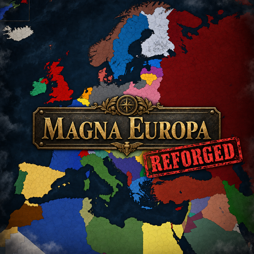

<div align="center">



# Magna Europa: Reforged


[](https://steamcommunity.com/sharedfiles/filedetails/?id=3809580289)

**English** | [简体中文](README_zh-CN.md)

**A total map-overhaul mod for Hearts of Iron IV — Europe, but with more detail and additional content.**

**Rebuilding the world on a far denser province grid, porting the full vanilla + DLC game content onto it.**

</div>

> [!NOTE]
> **Reforged** is the community continuation of the original *Magna Europa* project, migrated to HoI4 **1.19.\*** and under active development.

> [!CAUTION]
> This mod is based on [Magna Europa Alpha](https://steamcommunity.com/sharedfiles/filedetails/?id=3586596093), but heavily prunes and reworks the original Alpha's content. It should therefore be treated as **incompatible with any submod made for the original Magna Europa Alpha**, as well as any other mod that changes game content. For specific cases, please check the [compatibility list](COMPATIBILITY.md).

---

## Features

- **Rebuilt map** — ~21,600 provinces, ~2,980 states, redrawn strategic regions, railways, supply nodes, rivers and adjacencies
- **440+ countries** — new tags, releasables and cosmetic nations across Europe and beyond
- **Full content port** — national focus trees, events, decisions, characters and AI plans for all majors and DLC nations, remapped to the new map (Götterdämmerung, Arms Against Tyranny, By Blood Alone, Graveyard of Empires, No Step Back, La Résistance, Man the Guns, Waking the Tiger, Trial of Allegiance, Thunder at Our Gates, and more)
- **Two start dates** — *The Gathering Storm* (1 Jan 1936) and *Blitzkrieg* (14 Aug 1939)
- **New mechanics on top** — formable-nation decisions, dynamic state renaming, scripted GUIs, custom game rules
- **Localisation** — English (complete), Russian, Simplified Chinese (in progress)

## Installation

1. Subscribe on the Steam Workshop: [Magna Europa: Reforged](https://steamcommunity.com/sharedfiles/filedetails/?id=3809580289)
2. Enable **Magna Europa: Reforged** in the launcher playset and start the game.

## Compatibility

This mod uses `replace_path` on `history/`, `events/`, `map/strategicregions` and most of `common/`, and ships its own map bitmaps that shadow the vanilla ones at identical paths. It effectively replaces the entire game state. **Assume it is incompatible with every other mod**, including submods, unless explicitly stated otherwise.

- Required game version: **1.19.\***
- No DLC is strictly required; DLC-specific content is gated by the usual `has_dlc` checks.
- For per-DLC and per-mod status see the [compatibility list](COMPATIBILITY.md).

## Repository layout

| Path | Contents |
|---|---|
| `map/` | Province/state bitmaps, `definition.csv`, adjacencies, railways, strategic regions |
| `common/` | Game database: countries, focus trees, decisions, ideas, characters, scripted effects/triggers, technologies, units, AI |
| `events/` | Event scripts (vanilla + DLC ported, plus MER additions) |
| `history/` | Country, state, unit and general history — fully replaced |
| `localisation/` | `english/`, `russian/`, `simp_chinese/` |
| `interface/`, `gfx/` | UI scripts, flags, portraits, fonts |
| `music/` | Mod music tracks and playlists |
| `descriptor.mod` | In-mod descriptor (name, version, `replace_path` set) |
| `Magna Europa.mod` | Launcher-facing descriptor — copied to `mod/` and given a `path=` |

Files and directories prefixed with `_` (e.g. `_dev/`, `_audit_*.tsv`, `_118_base/`) are migration and audit artifacts used during the 1.19 port. They are `.gitignore`d and **not part of the shipped mod**.


## Contributing

### Development setup


1. **Unsubscribe / uninstall any Workshop copy of Magna Europa first.** The Git build reuses the same workshop ID and will conflict with it.
2. Clone this repository anywhere on disk:

   ```bash
   git clone https://github.com/AzurCrystal/Magna-Europa.git
   ```

3. Copy `Magna Europa.mod` from the repo into your launcher mod folder:

   ```
   Documents/Paradox Interactive/Hearts of Iron IV/mod/
   ```

4. Open **the copy** in `mod/` and set the `path=` line to your clone location, e.g.:

   ```
   path="D:/Projects/Magna-Europa"
   ```

   > **Note**: `descriptor.mod` inside the repo is the in-mod descriptor — do **not** edit it. Only the `Magna Europa.mod` copy placed in `mod/` carries a `path=` line.

5. Enable **Magna Europa: Reforged** in the launcher playset — the clone appears as a local "on disk" mod — and start the game.

### Reporting issues & contributing

- Bug reports: open a [GitHub issue](https://github.com/AzurCrystal/Magna-Europa/issues) with game version, mod version, and `error.log` excerpts where relevant.
- Pull requests are welcome — fork, branch, PR against [`AzurCrystal/Magna-Europa`](https://github.com/AzurCrystal/Magna-Europa).
- Original project upstream: [`Cyberbace-company/Magna-Europa`](https://github.com/Cyberbace-company/Magna-Europa)

## Credits

- **Magna Europa** original team — map, scenario and content foundation
- **Reforged** maintainers — 1.19 migration, map remapping and ongoing development
- Paradox Interactive — Hearts of Iron IV and all ported DLC content
